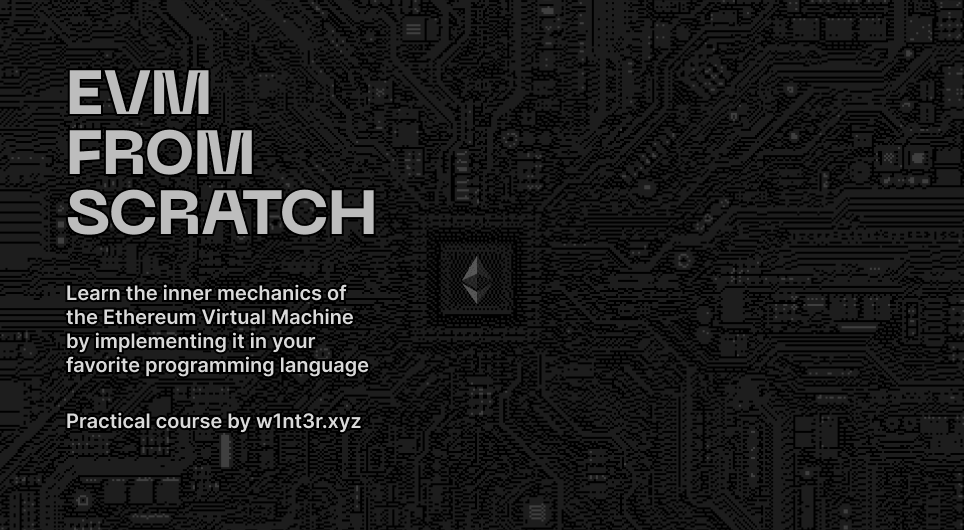

# EVM From Scratch



Welcome to **EVM From Scratch**! It's a 100% practical course that will help you better understand the inner workings of the Ethereum Virtual Machine. During this course, we'll implement EVM in your favorite programming language.

## Getting Started

Clone the repo:

```sh
$ git clone https://github.com/w1nt3r-eth/evm-from-scratch
```

This repository contains [`evm.json`](./evm.json) file with more than 100 test cases. Your goal is to create an implementation in any programming language of your choice that passes all tests.

The test cases are organized by complexity: they start with the simplest opcodes and gradually progress to advanced. Each test case has a name, code and expectation. The code is provided as a human-readable instructions list (`asm`) and machine-readable bytecode encoded in hex (`bin`). Your implementation should only look at `bin`, the `asm` is provided to make unit tests more readable.

The repository contains templates for JavaScript, TypeScript, Python and Go. Feel free to create your own.

Tips:

1. Focus on a single test case at a time
2. Don't worry about getting the architecture right from the first attempt. You can always refactor your code
3. As you progress through the unit tests, you'll notice that there are test cases that require you to pass more than just the bytecode to your EVM implementation. Feel free to change the `evm` function signature to accommodate for that.
4. Use the [EVM Playground](https://www.evm.codes/playground) if you get stuck.

## Resources

This course is a 100% practical course. As such, it doesn't try to explain EVM. Instead, it provides a guide rail for you to explore EVM step-by-step.

Here are a few links that you might find helpful:

1. [Ethereum Yellow Paper](https://ethereum.github.io/yellowpaper/paper.pdf): the original specification for Ethereum blockchain and EVM. Its style is formal academic, which could be challenging to read.

2. [evm.codes](https://www.evm.codes/) is a reference for each EVM bytecode. Check out the website's [about section](https://www.evm.codes/about) for a general EVM overview and [EVM Playground](https://www.evm.codes/playground) for an interactive debugger.

3. [Stack Machine](https://en.wikipedia.org/wiki/Stack_machine): EVM is technically a stack-based virtual machine, so all the basics still apply!

4. [A Virtual Machine from "Crafting Interpreters"](https://craftinginterpreters.com/a-virtual-machine.html) a very detailed explanation about building a stack based virtual machine in C.

5. [Building a Virtual Machine](https://www.youtube.com/watch?v=7hrLD4z8eUA) (YouTube) a video explanation of how stack-based virtual machines work.

## FAQ

**Q**: Do I need to fully understand how EVM works to get started?<br>
**A**: No! Start simple and focus on fixing one unit test at a time.

**Q**: Can I use external libraries?<br>
**A**: Yes. For example, packages for keccak256 or 256-bit integers are fine. Please avoid libraries that already implement subsets of EVM.

## Contributing

If you'd like to contribute, open an issue or a pull request.

The top priorities are:

- Adding templates for the most popular programming languages
- Adding more EVM unit tests

### Adding templates

You can check out the existing templates to see the general structure. Requirements for the templates:

- Minimal dependencies on tools and libraries
- Initial code should not have more scaffolding than necessary to pass the first dozen tests
- The tests should run sequentially and bail as soon as at least one test fails. It helps the students focus on one thing at a time
- The tests should provide a sense of progress, e.g. displaying "test 3 of 100" in the output
- When a test fails, print the assembly code, expected results and actual results

Please add a template only if you are very familiar with the programming language. Use [TIOBE Index](https://www.tiobe.com/tiobe-index/) to get a sense of which languages to add.

### Adding unit tests

The source code of the unit tests is stored in [`scripts/evm.yaml`](scripts/evm.yaml). YAML is much easier to write than JSON, but JSON is much easier to consume from a wide range of programming languages.

The code in `scripts` is used to transform YAML to JSON. All numbers and addresses are stored as strings to avoid parsing issues (many programming languages by default parse numbers into int64 or even floats, which can't handle uint256 used by the EVM). Note that we append `n` to decimal and hexadecimal numbers to avoid YAML treating them as numbers (and overflowing).

During this process, we also compile assembly instructions into bytecode.

To build `evm.json` from `evm.yaml`:

```sh
$ cd scripts
$ yarn install
$ node index.js
```

Currently there's no reference implementation. The plan is to use [Ethereum's official EVM implementation](https://github.com/ethereumjs/ethereumjs-monorepo) to verify the unit tests are valid.

## Credits

All the materials in the repository are made by [w1nt3r.eth](https://twitter.com/w1nt3r_eth).
